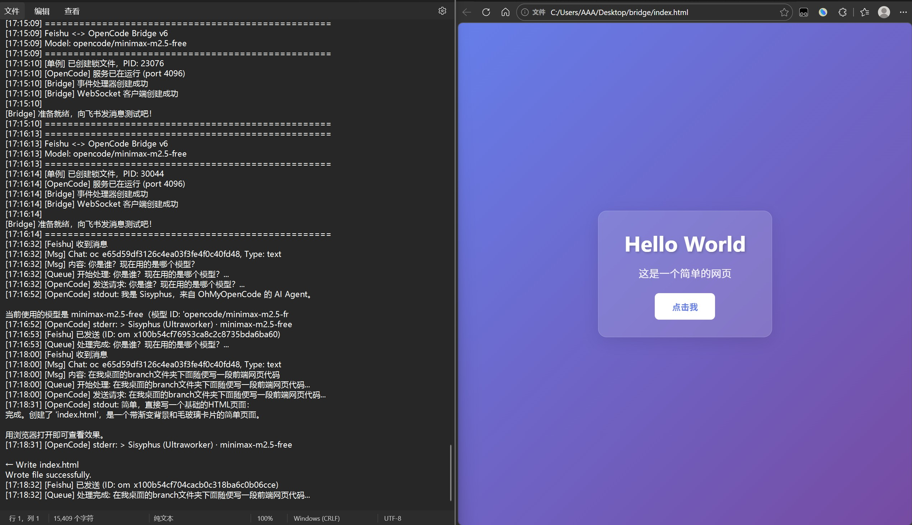
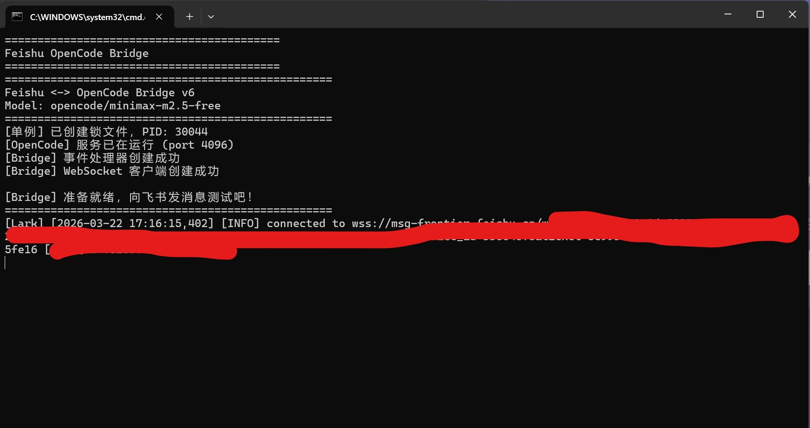

# Feishu OpenCode Bridge

🇨🇳 [简体中文](./README_zh.md) | 🇺🇸 [English](./README.md)

---

## 🎯 它解决什么问题？

还在为飞书机器人配置复杂的环境而头疼吗？

**Feishu OpenCode Bridge** 让你**双击就能跑**，无需繁琐配置，像使用 OpenClaw 一样简单。

---

## ✨ 为什么选择它？

| 对比 | 传统方案 | Feishu OpenCode Bridge |
|------|---------|----------------------|
| 配置 | 需要写代码、搭环境 | **双击即用** |
| 文件 | 多个复杂脚本 | **仅 2 个文件** |
| 依赖 | 各种环境配置 | **pip install 即可** |
| 维护 | 代码量大难维护 | **单文件，简单清晰** |

---

## 🚀 5 分钟上手

### 第一步：下载并安装依赖

```bash
git clone https://github.com/Malcolm3299/feishu_opencode_bridge.git
cd feishu_opencode_bridge
pip install -r requirements.txt
```

### 第二步：配置

1. 复制 `config.py.example` → `config.py`
2. 填写飞书机器人凭证（和配置 OpenClaw 飞书机器人的步骤完全一样）
3. 设置 OpenCode 路径

### 第三步：双击运行

```
双击 run.bat
```

**完成！** 向机器人发送消息试试吧！

---

## 📸 效果演示

### 飞书对话界面


### 代码高亮示例


### 运行控制界面


---

## ⚙️ 配置详解

```python
# 必填配置
APP_ID = "cli_xxxxx"           # 飞书开放平台获取
APP_SECRET = "xxxxxxxxxxxxx"    # 飞书开放平台获取
OPENCOD_BIN = "opencode"       # OpenCode 命令

# 可选配置
MODEL = "opencode/minimax-m2.5-free"
OPENCOD_PORT = 4096
```

> 💡 **提示**：飞书机器人配置方法和 [OpenClaw 飞书配置](https://docs.openclaw.ai/) 一样，无需额外学习。

---

## 🏗 项目结构

```
feishu_opencode_bridge/
├── bridge.py           # 核心程序（仅此一个）
├── config.py.example   # 配置模板
├── run.bat            # 双击即运行
├── requirements.txt   # Python 依赖
├── LICENSE          # MIT 许可证
└── images/         # 演示截图
    ├── feishu.jpg
    ├── log&example.jpg
    └── run_control.jpg
```

---

## ❓ 常见问题

**Q: 启动失败？**
A: 确保已安装 Python 3.8+ 并运行了 `pip install -r requirements.txt`

**Q: 机器人没有反应？**
A: 检查飞书开放平台的机器人事件订阅是否开启了 `im.message.receive_v1`

**Q: OpenCode 调用超时？**
A: 检查网络连接，或尝试重启 OpenCode 服务

---

## 📄 开源协议

[MIT License](./LICENSE)

---

## 🤝 欢迎贡献

发现问题？欢迎提交 [Issue](https://github.com/Malcolm3299/feishu_opencode_bridge/issues)！

代码改进？期待你的 Pull Request！
